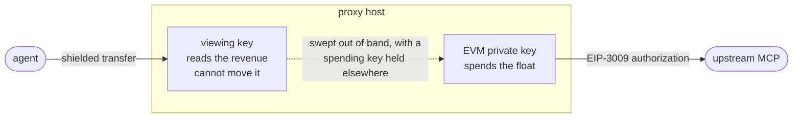
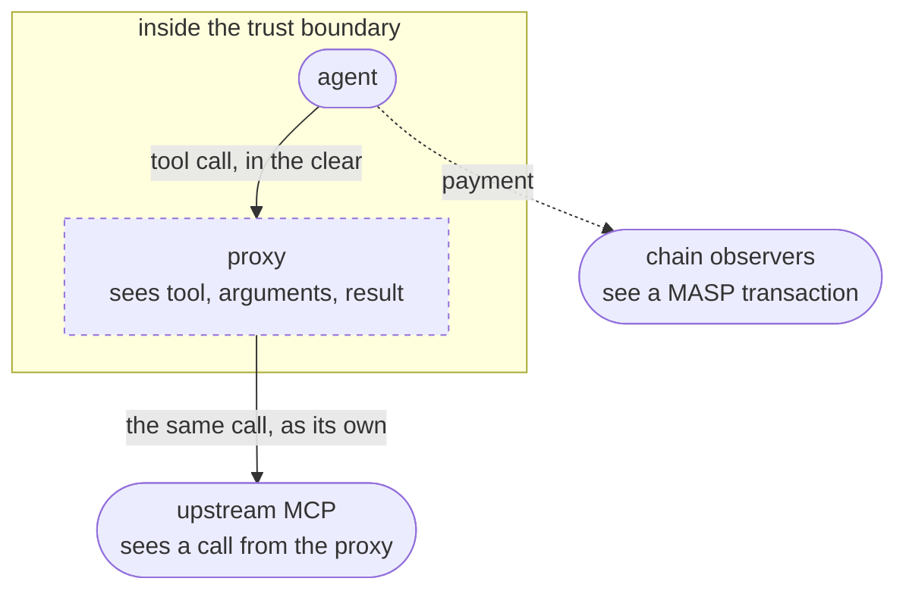
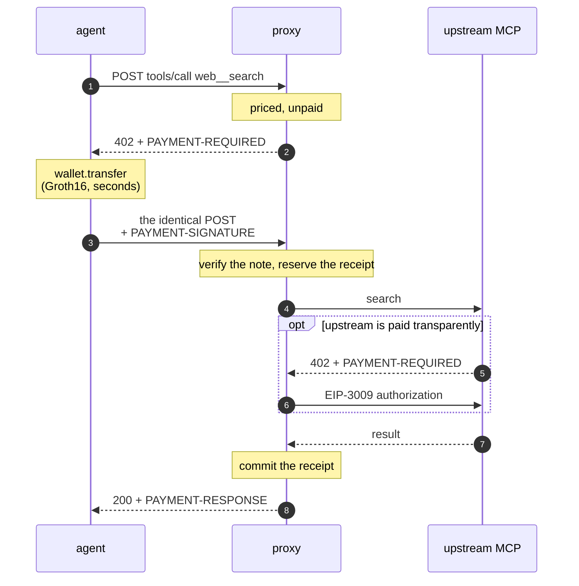
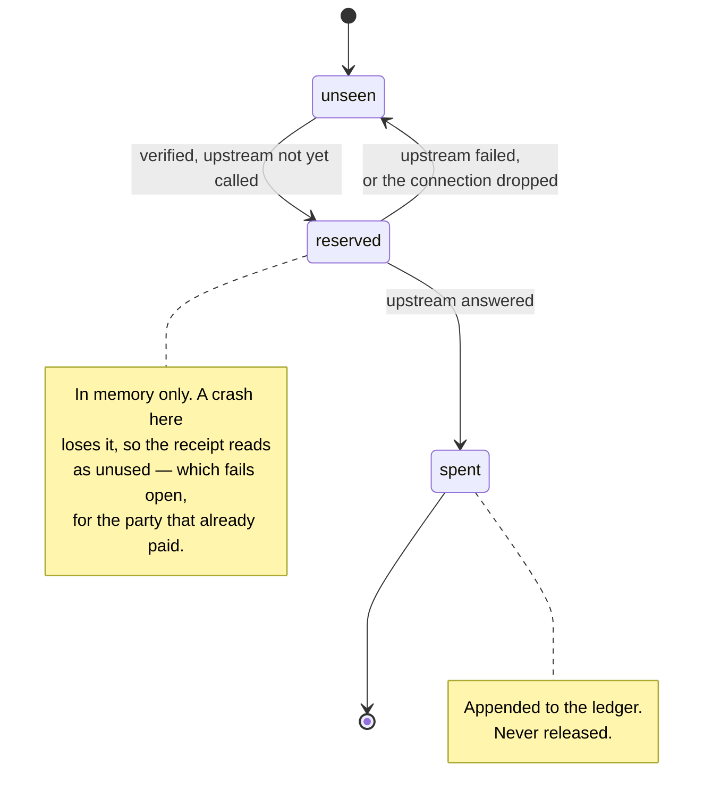

# mcp-x402

An MCP **proxy**: it fronts other MCP servers and charges per tool call in
shielded x402 payments.

An agent points at this one server, discovers every upstream's tools, and pays
per call from a shielded wallet. No API key, no account, no signup with any
upstream.

The SDK already implements the payer (`@lelantos-org/sdk/x402`). Nothing in this
repo could *accept* a shielded payment; this is that half, plus the proxy.

## The two legs



The proxy holds **no shielded spending key**. Revenue arrives as notes it can
read and cannot move; upstreams are paid from a separate transparent balance. A
compromise of this host leaks the calls passing through it and drains whatever
float was funded — not the shielded balance, which no key here can touch.

The cost of that is that the legs do not reconcile themselves. Shielded revenue
accrues; the float drains. Closing the loop means sweeping with a spending key
held somewhere else, which is where it belongs.

Each upstream chooses how it is paid:

| `payment` | how | needs `MCP_EVM_PRIVATE_KEY` |
| --- | --- | --- |
| `credential` (default) | the operator's API key or subscription, in `headers` or the child's `env` | no |
| `transparent` | its 402s are settled with an EIP-3009 authorization from the EVM account | yes |

`transparent` on a stdio upstream is rejected — a child process has no 402 to
answer — and so is a `transparent` upstream with no account configured; both fail
at boot rather than at the first call.

The authorization is signed with `signTransferAuthorization` from the SDK, so the
account never needs gas: the upstream's facilitator submits it. `MCP_EVM_MAX_PER_CALL`
is required, not defaulted, because the float is hot and an upstream quotes its
own price — without a ceiling, one call can empty it.

It is required **per token**, as `0xToken=1000000,0xOther=500000000000000`, for
the reason `pricing.fee.flat` is: base units are denominated in the token, so one
figure is a real ceiling in a six-decimal token and no ceiling at all in an
eighteen-decimal one. The tokens it names are also the allowlist — a token with
no ceiling is refused rather than paid under someone else's figure, and there is
no "any token", which admits no ceiling. A bare amount still works alongside
`MCP_EVM_TOKENS` when that names exactly one token; anything else fails at boot.

### What happens when an upstream refuses or overcharges

The agent has already paid by then. Every refusal in `settle.ts` throws before
anything is signed, which fails the upstream call, which **releases** the agent's
reservation — so the agent keeps a receipt it can present again rather than
having bought an error. The one thing that cannot be undone is an upstream that
takes a valid authorization and still answers 402; that is refused loudly and
never retried, because retrying would sign a second authorization against the
same float.

Not yet done: the float is not checked before quoting. A proxy that has run dry
still advertises prices and still accepts payment, and only fails at the upstream
call — safely, but later than it should.

## What is and is not private

This buys the agent privacy **from the upstreams and from the chain**:

- the upstream sees this proxy, never the agent — no identity, no key, no account;
- the payment is a shielded transfer, so on-chain observers see a MASP
  transaction, not "this agent bought that tool";
- the upstream is not in the payment path at all and need not know x402 exists.

It does **not** make the call private from the proxy. **The proxy operator sees
every tool name, every argument and every result in plaintext**, and can
correlate them by timing. This is a VPN-shaped trust move: it relocates trust, it
does not remove it. Run it yourself, or trust whoever does.



## How it works

x402 is an HTTP protocol and MCP over streamable HTTP is a POST, so they compose
without either knowing about the other:



The retry is the *identical* POST — the payer's wrapped `fetch` handles the 402
and repeats it, so the MCP layer never sees a payment.

`initialize` and `tools/list` are always free: an agent that cannot discover the
tools cannot learn what they cost. Listed tools carry their prices in both the
description and `_meta["x402/prices"]`.

Tools are namespaced `<upstream>__<tool>`, so two upstreams may both export
`search`. The namespace is stripped before forwarding; upstreams never see it.

## What it charges

Each tool has a **base** price, and the proxy adds its **fee** on top:

```jsonc
"pricing": {
  "default": { "asset": "1", "amount": "1000" },   // base, for anything unnamed
  "tools":   { "demo__shout": { "asset": "1", "amount": "250" } },
  "free":    ["demo__whoami"],                     // free, fee included
  "fee":     { "bps": 250, "flat": "5", "minimum": "10" }
}
```

A price may also be a **list**, which is how a tool is offered in more than one
asset:

```jsonc
"pricing": {
  "default": [
    { "asset": "1", "amount": "1000" },            // 1 USDC
    { "asset": "2", "amount": "3" }                // or 0.003 WETH
  ],
  "fee": { "bps": 250, "flat": { "1": "5", "2": "1" } }
}
```

The entries are **alternatives, not a sum**: the 402 carries one `accepts[]`
entry per asset, in the order written, and the payer settles exactly one of them
— the first its balance covers. So the order is this proxy's preference and the
payer's holdings decide between them; an agent holding no USDC pays in WETH
without either side negotiating. A list may not name the same asset twice: two
quotes in one asset are two answers to what the call costs, and a presented
payment is matched to its quote by asset.

`bps` is a share of the base, so it carries across assets unchanged. `flat` and
`minimum` are amounts, and 5 circuit units of one asset is not 5 of another —
state them per asset, as above. A bare `"flat": "5"` is still accepted while the
price list names a single asset, and is **refused at boot** once it names more
than one, rather than quietly overcharging in one asset and undercharging in the
other. A fee keyed to an asset no price uses is refused the same way — it would
be charged to nobody. An asset with no `flat` of its own pays the proportional
cut alone.

`fee = flat + ceil(base * bps / 10000)`, lifted to `minimum` if it falls below,
then `total = base + fee`. Basis points over `10_000` rounded up, matching
`Fees.unitFee` in the protocol: a fee that rounded down would be zero for every
call cheap enough, which is exactly the traffic a proxy most needs to cover.

The split is published, not just the total — a caller is entitled to know what it
pays the upstream and what it pays this proxy. With a wallet connected, prices
are rendered in human units too:

```
demo__shout | Uppercase a string. (costs 0.262 USDC (0.25 upstream + 0.012 proxy fee))
            | {"x402/prices":[{"asset":"1","amount":"262","base":"250","proxyFee":"12",
            |                  "display":{"base":"0.25 USDC","fee":"0.012 USDC","total":"0.262 USDC"}}]}
```

`x402/prices` is always a list, in the order the 402 offers them; a tool priced
in one asset is the one-entry case, not a different shape. Several quotes read as
`or` in the description — a reader who took them for a sum would think the call
cost the lot.

`250 units of asset 1` is not a price anyone can judge: circuit units are the
protocol's internal denomination and the asset id is a registry index, so the
figure could be a thousandth of a cent or fifty dollars. The conversion needs the
asset's `scale` and ERC-20 `decimals`, so registry entries are read once at boot
through the watch wallet and every price rendered from them.

**Raw units stay authoritative** — they are what the payer has to match — and
`display` is for deciding, not for paying. Rendering rounds **up**, so a
displayed price never understates what the 402 will ask for. Dev mode has no
wallet and so no registry, and falls back to raw units:

```
demo__shout | Uppercase a string. (costs 262 units of asset 1 (250 upstream + 12 proxy fee))
```

An asset that does not resolve — no registry entry, or a chain adapter with no
`tokenMeta` — shows raw units rather than stopping the server. It is all three
figures or none: a listing that rendered the total but not the fee would read as
though the fee were free.

The breakdown also rides along in the 402, as `extra.priceBreakdown` on each
`accepts[]` entry, in exactly the same shape — so an agent that read the listing
and an agent that came straight to the call are looking at the same fields.

Two edges worth knowing: a tool in `free` costs nothing, fee included; and a tool
with a base of `0` costs the fee alone. A total of zero is treated as free rather
than quoted — `requireAmount` rejects a non-positive `amount`, so a zero-priced
offer is one every payer silently skips.

## Paying only for work that happened

An upstream can fail after payment is verified. So a receipt is **reserved**
before the upstream is called and **committed** only once it answers; a failure
releases it, leaving the payer a receipt it can present again rather than having
bought an error. A dropped connection releases it too.



A reservation is in memory, so a crash mid-call loses it and the receipt reads as
unused — which is the safe direction for the party that already paid.

## Verification

A payment is a note, and the note is the authority.

`payment.ts` turns the header into a `Receipt` — pool, tx hash, commitment. The
payload's `asset` and `amount` are deliberately *not* on that type: they are the
payer's claims about its own transfer, and leaving them out makes it impossible
to accidentally trust them.

`verify.ts` then:

1. the receipt names our pool;
2. the commitment is not spent or in flight (`ledger.ts`);
3. `awaitCommitments` sees it land, within `MCP_VERIFY_TIMEOUT_MS`;
4. it appears in `notes()` — which, being a viewing-key decryption, is also the
   proof that it is addressed to us;
5. its **asset and value** cover the price;
6. it is reserved, pending the upstream call.

Steps 1, 2 and 6 are shared by both verifiers, so `devVerifier` is "no chain
check" rather than a second copy of the procedure with the checks removed.

## Running it

```sh
npm install
cp mcp.config.example.json mcp.config.json    # declare upstreams and prices
cp .env.example .env                          # LELANTOS_VIEWING_KEY, MCP_CHAIN_ID
npm run dev
```

Without a pool in reach, `MCP_DEV_ACCEPT_UNVERIFIED=1` skips steps 3–5 (replay
protection still applies) and `MCP_PAY_TO` becomes required:

```sh
MCP_DEV_ACCEPT_UNVERIFIED=1 MCP_CHAIN_ID=31337 MCP_PAY_TO=lelantos1... npm run dev
```

`test/fixtures/upstream-server.mjs` is a two-tool stdio MCP server for exercising
the whole path locally.

## Client side

```ts
import { connect } from "@lelantos-org/sdk";
import { x402 } from "@lelantos-org/sdk/x402";
import { Client } from "@modelcontextprotocol/sdk/client/index.js";
import { StreamableHTTPClientTransport } from "@modelcontextprotocol/sdk/client/streamableHttp.js";

const wallet = await connect({ network: "anvil", rpcUrl, mnemonic });
await wallet.sync();

const pay = x402(wallet, { budget: { total: "5" }, allowHosts: ["proxy.example.com"] });
const transport = new StreamableHTTPClientTransport(new URL(url), { fetch: pay });
await new Client({ name: "agent", version: "1" }).connect(transport);
```

## Layout

| file | role |
| --- | --- |
| `upstream.ts` | upstream connections, namespacing, forwarding |
| `settle.ts` | paying an upstream from the transparent balance |
| `pricing.ts` | the price policy, the proxy's fee, and the arithmetic |
| `catalogue.ts` | tools discovered at boot, priced by that policy |
| `display.ts` | presenting a price: human amounts, and one published shape |
| `proxy.ts` | the MCP server this process presents |
| `offer.ts` | the `PAYMENT-REQUIRED` document |
| `payment.ts` | header codec, `Receipt`, `parsePayment` |
| `gate.ts` | pure: body + header -> free / challenge / payment / reject |
| `verify.ts` | chain and dev verifiers over a `Receipt` |
| `ledger.ts` | reserve / commit / release |
| `http.ts` | request handling |
| `index.ts` | bootstrap |

## Known limitations

- **The proxy sees everything.** See above. This is the central tradeoff.
- **A payment is not bound to a request.** An upfront shielded transfer carries
  no reference to the call it pays for, so any unspent receipt of the right size
  redeems any call at that price. The ledger stops reuse and the price check
  stops a cheap receipt buying an expensive tool; binding would need a memo field
  the network does not have.
- **Discovery is done once, at boot.** An upstream that adds a tool later is not
  picked up until restart. Deliberate: it keeps unpaid requests from reaching
  upstreams at all.
- **Batches containing a priced call are refused**, because HTTP has one status
  code and a batch could mix free and priced calls.
- **Upstream credentials live in `mcp.config.json`.** That file is the thing to
  protect; it is what the agent is paying not to need.
- **`@lelantos-org/sdk` is linked from `../sdk`**, not the GitHub Packages
  registry, because the registry needs `NODE_AUTH_TOKEN`. Switch the dependency
  to `^0.39.1` and copy a sibling's `.npmrc` to use the published build.
